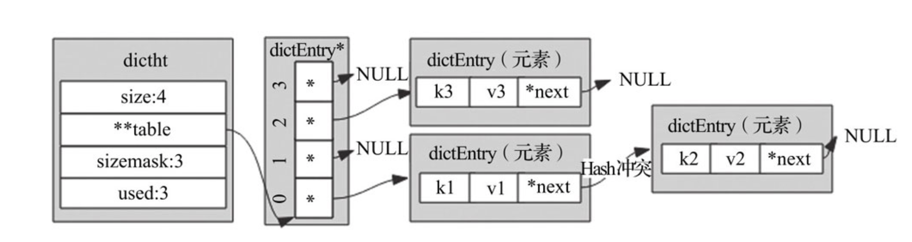
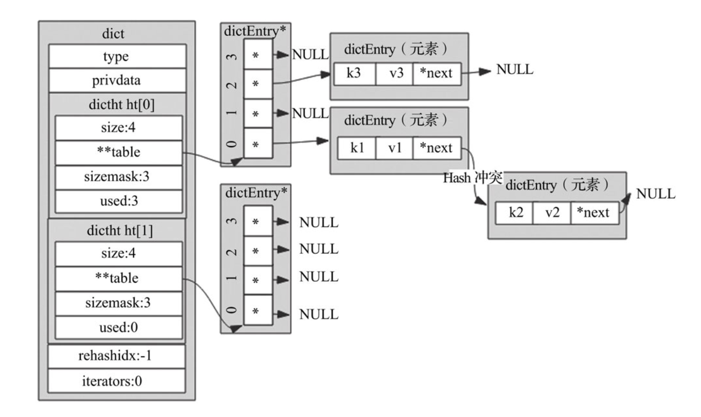
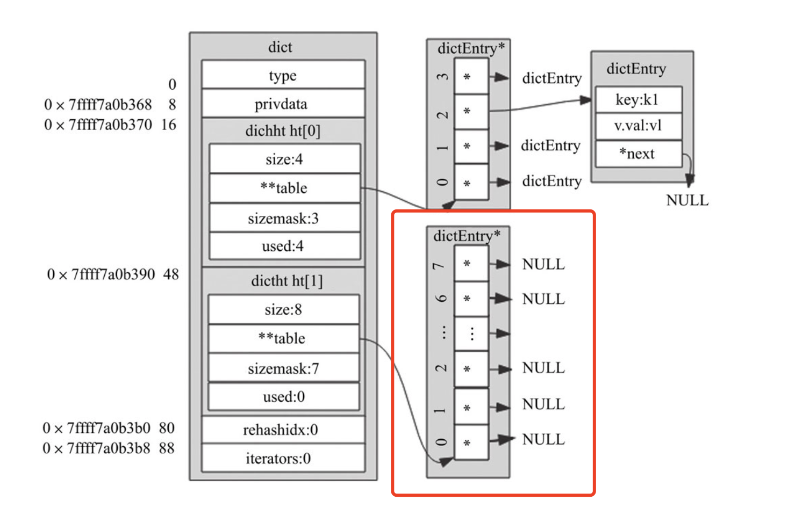

# Dict 字典（散列表）
Redis 字典实现依赖的数据结构主要包含了三部分：字典、Hash表、Hash表节点。 字典中嵌入了两个Hash表，Hash表中的table字段存放着Hash表节点，Hash表节点对应存储的是键值对。
* Hash表结构占用32字节：
```c
typedef struct dictht{
   dictEntry **table; // 指针数组，用于存储键值对
   unsigned long size; //table数组的大小
   unsigned long sizemask; // 掩码 = size -1
   unsigned long used;  // table 数组已存元素个数   
} dinctht；
```

* Hash表节点 占用24个字节：
```c
typedef struct dictEntry{
   void *key;   // 存储键
   union {
       void *val;    // db.dict 中的val
       uint64_t u64;  
       int64_t s64;  // db.expires 中存储过期时间
       double d;
   }v;  //  值，是个联合体
   struct dictEntry *next; // 当 Hash 冲突时，指向冲突的元素，行程单链表
} dictEntry;
```
* key字段存储的是键值对中的键。v字段是个联合体，存储的是键值对中的值，在不同场景下使用不同字段。
* 例如，用字典存储整个Redis数据库所有的键值对时，用的是*val字段，可以指向不同类型的值；
* 再比如，字典被用作记录键的过期时间时，用的是s64字段存储；当出现了Hash冲突时，next字段用来指向冲突的元素，通过头插法，形成单链表。
> 示例：有3个键值对，分别依次添加k2=>v2、k1=>v1、k3=>v3，假设k1与k2 Hash出现冲突，那么这是3个键值对在字典中存储结构示意;



* 字典结构 占用96个字节：
```c
typedef struct dict{
   dictType *type; // 该字典对应的特定操作函数
   void *privdata; // 该字典依赖的数据
   dictht ht[2];  // Hash表，键值对存储
   long rehashidex; // rehash标识，默认值为-1代表没有进行rehash操作，不为-1时代表正进行rehash操作，存储的值表示Hash表ht[0]的rehash操作进行到了哪个索引值
   unsigned long iterators;  // 当前运行的迭代器数
} dict;
```


## Hash 的扩容
```c
/* Expand or create the hash table */
int dictExpand(dict *d, unsigned long size)
{
    /* the size is invalid if it is smaller than the number of
     * elements already inside the hash table */
    if (dictIsRehashing(d) || d->ht[0].used > size)
        return DICT_ERR;

    dictht n; /* the new hash table */
    unsigned long realsize = _dictNextPower(size);

    /* Rehashing to the same table size is not useful. */
    if (realsize == d->ht[0].size) return DICT_ERR;

    /* Allocate the new hash table and initialize all pointers to NULL */
    n.size = realsize;
    n.sizemask = realsize-1;
    n.table = zcalloc(realsize*sizeof(dictEntry*));
    n.used = 0;

    /* Is this the first initialization? If so it's not really a rehashing
     * we just set the first hash table so that it can accept keys. */
    if (d->ht[0].table == NULL) {
        d->ht[0] = n;
        return DICT_OK;
    }

    /* Prepare a second hash table for incremental rehashing */
    d->ht[1] = n;
    d->rehashidx = 0;
    return DICT_OK;
}
```
* 1. 申请一块新内存，申请内存的大小是当前Hash表容量的一倍
* 2. 把新申请的内存地址赋值给 ht[1]，并把字典的rehashidx标识由-1改为0，表示之后需要进行rehash操作


> 此后，新添加的键值对都往新的Hash表中存储；而修改、删除、查找操作需要在ht[0]、ht[1]中进行检查，然后再决定去对哪个Hash表操作。
> 除此之外，还需要把老Hash表（ht[0]）中的数据重新计算索引值后全部迁移插入到新的Hash表(ht[1])中，此迁移过程称作rehash，我们下面讲解rehash的实现。

## 渐进式 rehash
```c
int dictRehash(dict *d, int n) {
    int empty_visits = n*10; /* Max number of empty buckets to visit. */
    if (!dictIsRehashing(d)) return 0;

    while(n-- && d->ht[0].used != 0) {
        dictEntry *de, *nextde;

        /* Note that rehashidx can't overflow as we are sure there are more
         * elements because ht[0].used != 0 */
        assert(d->ht[0].size > (unsigned long)d->rehashidx);
        while(d->ht[0].table[d->rehashidx] == NULL) {
            d->rehashidx++;
            if (--empty_visits == 0) return 1;
        }
        de = d->ht[0].table[d->rehashidx];
        /* Move all the keys in this bucket from the old to the new hash HT */
        while(de) {
            uint64_t h;

            nextde = de->next;
            /* Get the index in the new hash table */
            h = dictHashKey(d, de->key) & d->ht[1].sizemask;
            de->next = d->ht[1].table[h];
            d->ht[1].table[h] = de;
            d->ht[0].used--;
            d->ht[1].used++;
            de = nextde;
        }
        d->ht[0].table[d->rehashidx] = NULL;
        d->rehashidx++;
    }

    /* Check if we already rehashed the whole table... */
    if (d->ht[0].used == 0) {
        zfree(d->ht[0].table);
        d->ht[0] = d->ht[1];
        _dictReset(&d->ht[1]);
        d->rehashidx = -1;
        return 0;
    }

    /* More to rehash... */
    return 1;
}
```
rehash除了扩容时会触发，缩容时也会触发。Redis整个rehash的实现，主要分为如下几步完成：
* 给Hash表ht[1]申请足够的空间；扩容时空间大小为当前容量*2，即d->ht[0].used*2；`当使用量不到总空间10%时，则进行缩容`。缩容时空间大小则为能恰好包含d->ht[0].used个节点的2^N次方幂整数，并把字典中字段rehashidx标识为0。
* 进行rehash操作调用的是dictRehash函数，**重新计算ht[0]中每个键的Hash值与索引值（重新计算就叫rehash）**，依次添加到新的Hash表ht[1]，并把老Hash表中该键值对删除。把字典中字段rehashidx字段修改为Hash表ht[0]中正在进行rehash操作节点的索引值。
* rehash操作后，清空ht[0]，然后对调一下ht[1]与ht[0]的值，并把字典中rehashidx字段标识为-1。

所以在单进程的Redis 中，rehash过程将非常缓慢，可能会造成很严重的不可用现象。Redis优化的思想很巧妙，利用分而治之的思想了进行rehash操作，大致的步骤如下：
* 执行插入、删除、查找、修改等操作前，都先判断当前字典rehash操作是否在进行中，进行中则调用dictRehashStep函数进行rehash操作（每次只对1个节点进行rehash操作，共执行1次）。
* 除这些操作之外，当服务空闲时，如果当前字典也需要进行rehsh操作，则会调用incrementallyRehash函数进行批量rehash操作（每次对100个节点进行rehash操作，共执行1毫秒）。
* 在经历N次rehash操作后，整个ht[0]的数据都会迁移到ht[1]中，这样做的好处就把是本应集中处理的时间分散到了上百万、千万、亿次操作中，所以其耗时可忽略不计。

## 字典的遍历
首先遍历的原则是：1.不重复出现数据；2.不遗漏任何数据，遍历的两种方式：
### keys：
> 问题：在迭代的过程中，如果有增删改操作可能会触发rehash，那么可能会导致迭代过程中数据缺失或者多次遍历到。

```c
typedef strcut dictIterator{
   dict *d;  // 迭代的字典
   long index; // 当前迭代到Hash表中哪个索引值
   int table,safe; // table 用于表示当前正在迭代的Hash表 即ht[0]与ht[1], safe 用于表示当前创建的是否为安全迭代器
   dictEntry *entry,*nextEntry;  // 当前节点，下一个节点
   long long fingerprint;  // 字典的指纹，当字典未发生改变时该值不变，发生改变时则值也会随着改变
} dictIterator;
```
#### 普通迭代器，只遍历数据
* 普通迭代器迭代字典中数据时，会对迭代器中fingerprint字段的值作严格的校验，来保证迭代过程中字典结构不发生任何变化，确保读取出的数据不出现重复。
* 调用dictGetIterator函数初始化一个普通迭代器，此时会把iter->safe值置为0，表示初始化的迭代器为普通迭代器
* 循环调用dictNext函数依次遍历字典中Hash表的节点，首次遍历时会通过dictFingerprint函数拿到当前字典的指纹值
* 当调用dictNext函数遍历完字典Hash表中节点数据后，释放迭代器时会继续调用dictFingerprint函数计算字典的指纹值，并与首次拿到的指纹值比较，不相等则输出异常"=== ASSERTION FAILED ==="，且退出程序执行。
>普通迭代器通过步骤1、步骤3的指纹值对比，来限制整个迭代过程中只能进行迭代操作，即迭代过程中字典数据的修改、添加、删除、查找等操作都不能进行，只能调用dictNext函数迭代整个字典，否则就报异常，由此来保证迭代器取出数据的准确性。

#### 安全迭代器，遍历的同时删除数据
* 调用dictGetSafeIterator函数初始化一个安全迭代器，此时会把iter->safe值置为1，表示初始化的迭代器为安全迭代器
* 循环调用dictNext函数依次遍历字典中Hash表的节点，首次遍历时会把字典中iterators字段进行加1操作，确保迭代过程中渐进式rehash操作会被中断执行。]
* 当调用dictNext函数遍历完字典Hash表中节点数据后，释放迭代器时会把字典中iterators字段进行减1操作，确保迭代后渐进式rehash操作能正常进行。
> 安全迭代器是通过步骤1、步骤3中对字典的iterators字段进行修改，使得迭代过程中渐进式rehash操作被中断，由此来保证迭代器读取数据的准确性。

### scan：
间断遍历字典的过程中会遇到如下3种情况：
* 从迭代开始到结束，散列表没有进行rehash操作
只要依次按照顺序遍历Hash表ht[0]中节点即可
* 从迭代开始到结束，散列表进行了扩容或缩容操作，且恰好为两次迭代期间完成了rehash操作
在遍历的整个过程中，期间字典可能发生了扩容或缩容操作，如果依然按照顺序遍历，则可能会出现数据重复读取的现象（Redis 为了不漏数据且尽量不重复数据，统一采用了二进制逆转的方式进行数据迭代）。
* 从迭代开始到结束，某次或某几次迭代时散列表正在进行rehash操作
因为大小两表并存，所以需要从ht[0]和ht[1]中都取出数据，整个遍历过程为：先找到两个散列表中更小的表，先对小的Hash表遍历，然后对大的Hash表遍历，同样会采用二进制逆转来改变游标。
