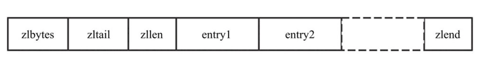
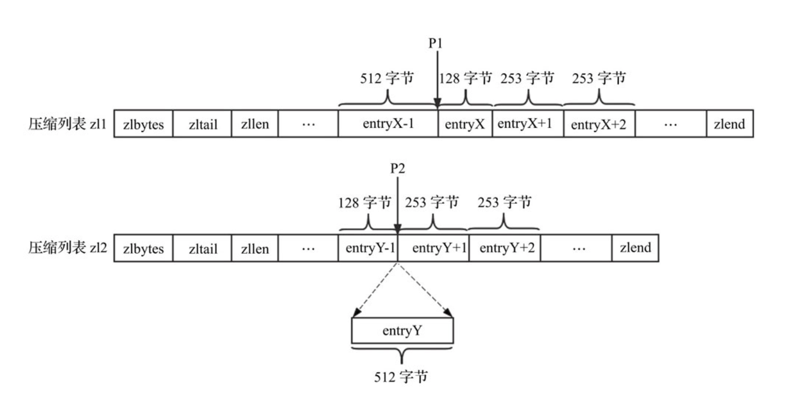

# ZipList （压缩列表）
压缩列表的本质伤就是一个字节数组，是 Redis 为了节约内存而设计的一种线性数据结构，可以包含多个元素，每个元素可以是一个字节数组或一个整数。

Redis的`zset、hash、list` 都使用了压缩列表：
* zset：
  * `zset_max_ziplist_entries 128`：个数小于128的则使用压缩列表
  * `zset_max_ziplist_value 64`：插入字符串长度小于64则使用压缩列表
 ```c
   // zsetAdd
   if (zzlLength(zobj->ptr) > server.zset_max_ziplist_entries ||
                  sdslen(ele) > server.zset_max_ziplist_value)
                  zsetConvert(zobj,OBJ_ENCODING_SKIPLIST);
  ```
* hash：
  * 
  * 
* list：
  * 
  *   
  
  
* zlbytes: 压缩列表的字节长度，占4个字节，因此压缩列表最多有 2的32次方-1 个字节。
* zltail: 压缩列表尾元素相对与压缩列表起始地址的偏移量，占4个字节
* zllen: 压缩列表的元素个数，占2个字节。zllen无法存储元素个数超过65535（2的16次方-1）的压缩列表，必须遍历整个压缩列表才能获取到元素个数。
* entryX: 压缩列表存储的元素，可以是字节数组或者整数，长度不限。`长度小于254的用1个字节表示，大于等于255的用5个字节来表示`
* zlend: 压缩列表的结尾，占1个字节，恒为0xFF


## 压缩列表的连锁更新

比如删除图中 压缩列表zl1 位置P1的元素entryX。
* 压缩列表zl1中，元素entryX之后的所有元素（entryX+1、entryX+2等）的长度都是253字节，显然这些元素previous_entry_length字段的长度都是1字节。
* 当删除元素entryX时，元素entryX+1的前驱节点改为元素entryX-1，长度为512字节，元素entryX+1的previous_entry_length字段需要5字节才能存储元素entryX-1的长度，则元素entryX+1的长度需要扩展至257字节
* 而由于元素entryX+1长度的增大，元素entryX+2的previous_entry_length字段同样需要改变。依此类推，由于删除了元素entryX，之后的所有元素（entryX+1、entryX+2等）的长度都必须扩展，而每次扩展都将重新分配内存，导致效率很低。
>从以上分析可以看出，连锁更新会导致多次重新分配内存及数据复制，效率很低。但是出现这种情况的概率是很低的，因此对于删除元素和插入元素操作，Redis并没有为了避免连锁更新而采取措施。